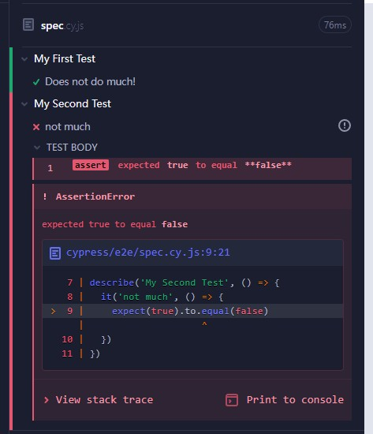

# Cypress-前端E2E测试工具初体验

前言：这个是跟着官方文档学习的一个记录，可能有误差！可以自行前往官网学习：https://docs.cypress.io/guides/end-to-end-testing/writing-your-first-end-to-end-test?utm_source=Binary%3A%20App&utm_medium=Docs%20Menu&utm_content=First%20Test#Write-your-first-test

## 什么是 Cypress

Cypress 是一个开源的前端测试自动化框架，用于模拟用户与页面交互的一个自动测试工具

## 安装 Cypress

```
npm i cypress --save-dev
```

然后你需要等待他下载 exe 文件到你的电脑

下载完成后修改你的 `package.json`，在 `script` 一栏修改成你的执行命令

```
{
  "name": "cypress",
  "version": "1.0.0",
  "description": "",
  "main": "index.js",
  "scripts": {
    "cypress:open": "cypress open"
  },
  "author": "",
  "license": "MIT",
  "devDependencies": {
    "cypress": "^10.10.0"
  }
}
```

然后就是启动

```
npm run cypress:open
```

## 从一个简单的用例开始

我们先新建一个测试文件，然后在里面写下两段脚本：

```js
// success
describe('My First Test', () => {
  it('Does not do much!', () => {
    expect(true).to.equal(true)
  })
})
// fail
describe('My Second Test', () => {
  it('Does not do much!', () => {
    expect(true).to.equal(false)
  })
})
```

在 cypress 运行后结果如下：


可以看到 cypress 捕获到了这个错误

## 测试一个真正的页面

### 1. 访问一个页面

```js
describe('My First Test', () => {
  it('Visits the Kitchen Sink', () => {
    // 页面访问
    cy.visit('https://example.cypress.io')
  })
})
```

### 2. 查找元素或内容

```js
describe('My First Test', () => {
  it('Visits the Kitchen Sink', () => {
    // 页面访问
    cy.visit('https://example.cypress.io')
    // 查找含有 type 的元素
    cy.contains('type')
    // 查找含有 type 的元素
    cy.contains('hype')
  })
})
```

运行结果如下：


在官方的示例页面中并没有含有 `hype` 这个单词的元素，因此抛出了错误

### 3. 模拟点击元素

```js
describe('My First Test', () => {
  it('Visits the Kitchen Sink', () => {
    // 页面访问
    cy.visit('https://example.cypress.io')
    // 查找含有 type 的元素并进行点击
    cy.contains('type').click()
  })
})
```

### 4. 进行断言

在上面进行了模拟点击后页面应该会跳转到点击元素指定的位置，因此我们可以用一个断言进行判断是否到了指定的位置

```js
describe('My First Test', () => {
  it('clicking "type" navigates to a new url', () => {
    cy.visit('https://example.cypress.io')

    cy.contains('type').click()

    // 判断当前 url 是否包含着 '/commands/actions'
    cy.url().should('include', '/commands/actions')
  })
})
```

到这里就已经完成了 Cypress 一个测试的流程，如果你想引入更多的测试，比如检测一个 input 是否可以正常输入内容，可以仿照这样子写：

```js
describe('My First Test', () => {
  it('Gets, types and asserts', () => {
    cy.visit('https://example.cypress.io')

    cy.contains('type').click()

    // 判断当前 url 是否包含着 '/commands/actions'
    cy.url().should('include', '/commands/actions')

    // 获取类名为 '.action-email' 的元素
    cy.get('.action-email')
      // 输入内容 'fake@email.com'
      .type('fake@email.com')
      // 判断是否含有指定内容
      .should('have.value', 'fake@email.com')
  })
})
```

**当然官方并不推荐通过类名去获取元素**，具体原因可以看官方文档的解释：https://docs.cypress.io/guides/references/best-practices#Selecting-Elements

官方最推荐的是在标签上添加 `data-` 的前缀以便顺利捕获元素，比如：

```html
<div data-cy="test">Test Element</div>
```

然后我们就可以通过这个自定义属性进行获取元素，并且获取的准确度大大提升
```js
cy.get('[data-cy="test"]').click()
```

## Cypress 有什么用？

看完整个流程我的第一反应是：这个人工测试也行啊，手动的自己测试，但后来想了一下，可能对于一些特定场景，自动化测试可能比手动好且效率高，以下列几个个人所想到的场景和想法：

- 执行大量操作，手动操作一下子记不住时
- 涉及到权限验证的操作，是否存在偶然性使得部分违规操作可行
- 简单但是有多种组合变化的操作
- 页面阻挡的元素被强制触发点击时的响应

希望在未来随着个人的学习与发展 Cypress 可以变得越来越重要